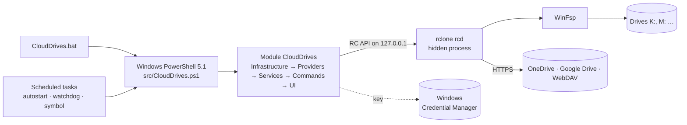

# Architecture of CloudDrives

*Deutsche Fassung: [ARCHITECTURE.md](ARCHITECTURE.md)*

This document explains how CloudDrives is built and why: the layers, the processes, the data, the way from a double
click to a drive, and the quirks of rclone and Windows you need to know. How to set up, check and publish the project
is in the [developer handbook](DEVELOPMENT.en.md); the rules for new code are in [CONTRIBUTING.en.md](../CONTRIBUTING.en.md).

The user interface is German or English, following Windows. German terms in quotes are names the user sees.

## Overview

CloudDrives mounts OneDrive, Google Drive (personal and Workspace), Nextcloud, IServ and other WebDAV storage as drive
letters in Windows. The work with the clouds is done by [rclone](https://rclone.org) in a hidden background process,
the "engine"; [WinFsp](https://winfsp.dev) provides the drive letters. CloudDrives itself is a PowerShell module that
runs in Windows PowerShell 5.1 and PowerShell 7 - no compiling, no runtime to install, readable for everyone.



## Layers

The module loads its files layer by layer (`src/CloudDrives.psm1`). **Dependencies only point down**: a layer only uses
functions of the layers before it.

| Layer | Folder | Responsibility |
|---|---|---|
| Infrastructure | `src/Infrastructure` | Technology without business logic: paths and locks (`Context`), settings, secrets, log, texts (`I18n`), error catalogue, network, processes, the engine and its RC API, the encrypted rclone configuration, providing rclone and WinFsp. |
| Providers | `src/Providers` | One definition per provider (`Register-CdProvider`): rclone type, kinds, preferred letters, answers to rclone's set-up questions, who is signed in. A new provider only needs a new file here. |
| Services | `src/Services` | The business logic: accounts and sign-in, drives, vaults, Explorer, autostart, watchdog, notification area symbol, diagnosis, support bundle, installation, updates, notifications. |
| Commands | `src/Commands` | Connecting and disconnecting across all drives - shared by menu, command line and background tasks. |
| User interface | `src/UI` | Command line (`Cli`), menu, wizards, notification area symbol. **Only this layer talks to the user.** |

**Services write nothing to the screen.** They return result objects (`New-CdResult`: `Success`, `Code`, `Message`,
`Data`) or throw an exception with an error code (`New-CdException`). That way menu, command line and the notification
area symbol can use the same services.

`src/Resources` holds what is not PowerShell: texts (`lang/de.json`, `lang/en.json`), the error catalogue
(`errors.json`), pinned versions and checksums (`dependencies.json`), package details (`app.json`), the icon and
`Native.cs` (small C# helpers, compiled at runtime with `Add-Type`).

## Processes

At runtime CloudDrives consists of several short processes and one long one:

| Process | Started by | Job |
|---|---|---|
| **Engine** (`rclone rcd`) | the first CloudDrives process that needs it | Holds all drives. Runs hidden and keeps running independently when the window closes. Only on `127.0.0.1`, random port, random credentials. |
| **Windows** (menu, wizards, diagnosis) | Start menu, desktop, symbol | In the classic console window (`conhost`) with `--window`, so the taskbar shows the CloudDrives icon. |
| **Autostart** | a scheduled task at sign-in (+30 s) | `connect --silent --autostart`: connects the drives, reports problems, looks for updates. |
| **Watchdog** | a scheduled task every 5 minutes, after waking up, after a network change | Reconnects wanted drives (after standby, a network change, a crash of the engine). |
| **Notification area symbol** | a scheduled task at sign-in (+10 s) | Status dot and menu (Windows Forms). Every action runs as a **process of its own**, so the symbol never hangs. Looks for updates every few hours. |
| **Background update** | autostart, symbol | `update --background`: looks and reports or installs - as set. |

Several processes work with the same data. Named mutexes (`Enter-CdLock`, per data folder) keep them out of each
other's way - for example when the engine starts or a state is written.

## The way to a drive

1. `CloudDrives.bat` changes to the user's profile folder, clears `PSModulePath` (so PowerShell 7 passes on no
   unsuitable modules) and starts `src/CloudDrives.ps1` with Windows PowerShell 5.1. Everything is on **one** line,
   because `cmd.exe` reads a batch file again after each command - and an update may have replaced it by then.
2. `CloudDrives.ps1` loads the module and calls `Invoke-CdCli`: prepare data folder, language and log, then the menu or
   the command. Exit codes: 0 all good, 1 partly, 2 error, 3 unknown command, 4 module could not be loaded.
3. **Connecting** (`Invoke-CdConnect`):

```mermaid
sequenceDiagram
    participant C as Invoke-CdConnect
    participant E as Engine (rclone rcd)
    participant W as WinFsp / Explorer
    C->>C: remember the wanted drives (for the watchdog)
    C->>C: wait for the network
    C->>E: start it or reuse the running one
    loop per drive
        C->>C: letter free?
        C->>E: for a vault: read its check file first (wrong password?)
        C->>E: mount/mount (network drive, file cache)
        E->>W: mount the drive
        C->>W: wait until Windows shows it; name in Explorer
    end
    C-->>C: one result per drive (one fails, the others go on)
```

4. **Disconnecting** (`Invoke-CdDisconnect`) waits for running uploads (`vfs/stats`) or, after asking, disconnects
   anyway; what has not been uploaded yet, rclone uploads at its next start.

## Data folder

Runtime data lives in `%LOCALAPPDATA%\CloudDrives` - never in the program folder and never in the repository.
`CLOUDDRIVES_HOME` or `--home=<folder>` chooses another one (tests, portable copy). A newly created data folder is
readable only by the user and SYSTEM.

| Path | Content |
|---|---|
| `settings.json` (+ `.bak`) | Accounts, drives, preferences - **never a secret**. With a schema version; older files are completed when loaded. |
| `rclone.conf` | Sign-ins (OAuth tokens, WebDAV passwords, vault keys). **Always encrypted.** |
| `backup\` | The last ten copies of `rclone.conf` before each change. |
| `logs\` | Daily logs of CloudDrives (redacted) and `rclone.log` (rotating). |
| `deps\rclone\<version>\` | `rclone.exe` in the pinned version. |
| `cache\` | The file cache of the drives. |
| `state\` | `engine.json` (port, process - no secrets), `wanted-drives.json` (which drives should be connected), `watchdog.json` (failed attempts), `update.json` (last look for updates), `secrets\` (only as a stand-in for the Credential Manager). |

The program itself lives in `%LOCALAPPDATA%\Programs\CloudDrives` (no administrator rights). During development it runs
straight from the repository.

## Security

- **Sign-in in the browser** (OAuth) with Google and Microsoft: CloudDrives never sees a password, only revocable
  tokens. Nextcloud hands out an app password of its own after the browser sign-in. IServ and other WebDAV servers get
  user name and password; the password stays a `SecureString` until it goes to rclone.
- **`rclone.conf` is always encrypted.** The key is a random 256-bit secret in the Windows Credential Manager (DPAPI,
  the user only) - or derived from a master password that is asked for at every start.
- **The engine** listens only on `127.0.0.1`, with a random port and credentials created anew at every start. Secrets
  reach rclone only through environment variables, never on the command line.
- **Logs and the support bundle are redacted** (tokens, passwords, e-mail addresses, user and computer name).
- **Downloads** (rclone, WinFsp, updates) are only accepted with the right SHA256 checksum.
- The limits are described in [SECURITY.md](../SECURITY.md).

## Building blocks in detail

- **Providers** (`src/Providers`): Google Drive (an own client ID is recommended, see [GOOGLE-OAUTH.md](GOOGLE-OAUTH.md)),
  OneDrive, WebDAV (Nextcloud with browser sign-in, IServ through `webdav.<school>`, other servers). Setting up runs
  through rclone's question-and-answer dialogue (`config/create`, `AccountSignIn.ps1`); the provider's definition
  answers the questions.
- **Drives** (`Drives.ps1`): a network drive with a name of its own (`\\CloudDrives\<id>`) and a file cache in mode
  `full`, so Office and other programs work as with local files. Free letters are suggested.
- **Explorer** (`Explorer.ps1`): display name through `_LabelFromReg`, the CloudDrives icon. **Names the user gives in
  Explorer are adopted and never overwritten.**
- **Vaults** (`Vault.ps1`): rclone crypt - contents and names are encrypted on the PC. A small check file (canary)
  detects a wrong password before files with a wrong key come about. See [ENCRYPTION.md](ENCRYPTION.md).
- **Watchdog** (`Watchdog.ps1`): reconnects only drives the user wants connected (`wanted-drives.json`); what the user
  disconnects stays disconnected. Failed attempts get growing pauses.
- **Diagnosis** (`Health.ps1`, `Doctor.ps1`): uniform check items with a traffic light, an error code and - where
  possible - an automatic fix. The support bundle (`Support.ps1`) packs them, redacted.
- **Updates** (`Update.ps1`): releases from GitHub, checked against `SHA256SUMS.txt`, installed like a fresh
  installation with a fall-back to the old version. Three ways (a notice with one-click install, automatic, only on
  request) plus test versions (`0.3.4-preview.1`, GitHub pre-releases). Automatic updates wait until no CloudDrives
  window is open.

## Error codes and texts

- Every error has a code `CD-xxxx`: 1xxx dependencies, 2xxx configuration and secrets, 3xxx sign-in and providers, 4xxx
  mounting, 5xxx network and engine, 6xxx encryption, 7xxx cache, 8xxx installation and updates, 9xxx internal.
- `Resources/errors.json` maps messages of rclone and Windows to a code and may name an automatic action; title and fix
  are in both language files. [TROUBLESHOOTING.md](TROUBLESHOOTING.md) is generated from it
  (`tools/New-TroubleshootingDoc.ps1`).
- All user interface texts come from `lang/de.json` and `lang/en.json` (`Get-CdText`); the language follows Windows. A
  test makes sure every key is in both files.

## Key decisions

- **A PowerShell module instead of a compiled program.** Runs on every Windows 10/11 without installing a runtime,
  without an unsigned `.exe` (so without false alarms from SmartScreen and virus scanners), and anyone can check it.
  Compatible with Windows PowerShell 5.1, because every PC has it.
- **One engine for all drives** instead of one `rclone mount` per drive: only one process writes the configuration (no
  token conflicts), state and uploads can be queried through the RC API, disconnecting is clean.
- **A network drive with a full file cache:** programs work as with local files, Explorer shows the real storage space.
- **Scheduled tasks instead of a Windows service:** drives must be mounted in the user's session for Explorer to show
  them. A service would run in another session and need administrator rights.
- **The symbol's actions as processes of their own:** a connect that waits for the network never blocks the symbol's
  menu.
- **The classic console window** instead of Windows Terminal: only there can CloudDrives show its own icon in the
  taskbar.
- **`Native.cs` stays one file:** Windows PowerShell compiles it at every start of a CloudDrives process; every further
  file would cost a compiler run.
- **Settings as ordered hashtables with a schema version:** simple migration, readable JSON.
- **An allowlist in `.gitignore`:** nothing gets into the repository unless it is explicitly allowed.
- **Separate from CloudDrive-Sync:** a program of its own with data of its own. Each opens the other from its
  notification area symbol.

## Quirks of rclone, WinFsp and Windows

- **rclone 1.75.1 is the minimum:** simple options for `mount/mount` through the RC API, `config/oauthstatus` for the
  sign-in, fixed memory leaks in a long-running `rcd`, a fixed 403 error with personal OneDrive accounts.
- **WinFsp** needs administrator rights once (UAC); everything else runs as the user.
- **Uploads when disconnecting:** `vfs/stats` shows what is still being uploaded; rclone resumes open uploads at its next
  start.
- **Google documents** appear as `.url` shortcuts that open in the browser.
- **Windows PowerShell 5.1 and PowerShell 7 differ:** 5.1 hands JSON lists over as one object, TLS 1.2 must be switched
  on in 5.1, scripts with umlauts need a BOM in 5.1, and 5.1 has no `? :`, `??` or `&&`. The code and the tests run in
  both.
- **`cmd.exe` reads batch files again after each command** - that is why everything important in `CloudDrives.bat` is on
  one line, and the working folder is never the program folder (an update could not replace it otherwise).
- **Windows Terminal** shows its own icon in the taskbar; CloudDrives therefore opens its windows in `conhost` and gives
  them an identity of their own (`Native.cs`, `ConsoleWindow`).
