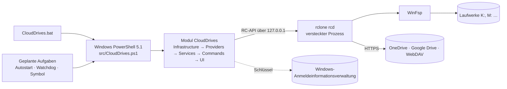

# Aufbau von CloudDrives

*English version: [ARCHITECTURE.en.md](ARCHITECTURE.en.md)*

Dieses Dokument erklärt, wie CloudDrives aufgebaut ist und warum: die Schichten, die Prozesse, die Daten, den Weg
vom Doppelklick zum Laufwerk und die Eigenheiten von rclone und Windows, die man kennen muss. Wie man das Projekt
einrichtet, prüft und veröffentlicht, steht im [Entwickler-Handbuch](DEVELOPMENT.md), die Regeln für neuen Code in
[CONTRIBUTING.md](../CONTRIBUTING.md).

## Überblick

CloudDrives bindet OneDrive, Google Drive (privat und Workspace), Nextcloud, IServ und andere WebDAV-Speicher als
Laufwerke in Windows ein. Die Arbeit mit den Clouds erledigt [rclone](https://rclone.org) in einem versteckten
Hintergrundprozess, der „Engine“; [WinFsp](https://winfsp.dev) stellt die Laufwerksbuchstaben bereit. CloudDrives
selbst ist ein PowerShell-Modul, das unter Windows PowerShell 5.1 und PowerShell 7 läuft – ohne Kompilieren, ohne
Installation einer Laufzeit, für jeden lesbar.



## Schichten

Das Modul lädt seine Dateien Schicht für Schicht (`src/CloudDrives.psm1`). **Abhängigkeiten zeigen nur nach unten**:
Eine Schicht benutzt nur Funktionen der Schichten davor.

| Schicht | Ordner | Aufgabe |
|---|---|---|
| Infrastruktur | `src/Infrastructure` | Technik ohne Fachlogik: Pfade und Sperren (`Context`), Einstellungen, Geheimnisse, Protokoll, Texte (`I18n`), Fehlerkatalog, Netz, Prozesse, die Engine und ihre RC-API, die verschlüsselte rclone-Konfiguration, rclone und WinFsp bereitstellen. |
| Anbieter | `src/Providers` | Je Anbieter eine Definition (`Register-CdProvider`): rclone-Typ, Arten, bevorzugte Buchstaben, Antworten auf rclones Einrichtungsfragen, wer angemeldet ist. Ein neuer Anbieter braucht nur eine neue Datei hier. |
| Dienste | `src/Services` | Die Fachlogik: Konten und Anmeldung, Laufwerke, Tresore, Explorer, Autostart, Watchdog, Symbol im Infobereich, Diagnose, Support-Paket, Installation, Updates, Benachrichtigungen. |
| Befehle | `src/Commands` | Verbinden und Trennen über alle Laufwerke – geteilt von Menü, Befehlszeile und Hintergrundaufgaben. |
| Oberfläche | `src/UI` | Befehlszeile (`Cli`), Menü, Assistenten, Symbol im Infobereich. **Nur diese Schicht spricht mit dem Nutzer.** |

**Dienste schreiben nichts auf den Bildschirm.** Sie geben Ergebnisobjekte zurück (`New-CdResult`: `Success`, `Code`,
`Message`, `Data`) oder werfen eine Ausnahme mit Fehlercode (`New-CdException`). So können Menü, Befehlszeile und das
Symbol im Infobereich dieselben Dienste nutzen.

`src/Resources` enthält, was keine PowerShell ist: Texte (`lang/de.json`, `lang/en.json`), den Fehlerkatalog
(`errors.json`), festgelegte Versionen und Prüfsummen (`dependencies.json`), Paketangaben (`app.json`), das Symbol und
`Native.cs` (kleine C#-Hilfen, zur Laufzeit mit `Add-Type` übersetzt).

## Prozesse

CloudDrives besteht zur Laufzeit aus mehreren kurzen und einem langen Prozess:

| Prozess | Gestartet von | Aufgabe |
|---|---|---|
| **Engine** (`rclone rcd`) | dem ersten CloudDrives-Prozess, der sie braucht | Hält alle Laufwerke. Läuft versteckt und unabhängig weiter, wenn das Fenster schließt. Nur auf `127.0.0.1`, Zufallsport, Zufallszugang. |
| **Fenster** (Menü, Assistenten, Diagnose) | Startmenü, Desktop, Symbol | Im klassischen Konsolenfenster (`conhost`) mit `--window`, damit die Taskleiste das CloudDrives-Symbol zeigt. |
| **Autostart** | geplante Aufgabe bei der Anmeldung (+30 s) | `connect --silent --autostart`: verbindet die Laufwerke, meldet Probleme, sieht nach Updates. |
| **Watchdog** | geplante Aufgabe alle 5 Minuten, nach dem Aufwachen, nach Netzwechsel | Verbindet gewollte Laufwerke wieder (nach Standby, Netzwechsel, Absturz der Engine). |
| **Symbol im Infobereich** | geplante Aufgabe bei der Anmeldung (+10 s) | Statuspunkt und Menü (Windows Forms). Jede Aktion läuft als **eigener Prozess**, damit das Symbol nie hängt. Sieht alle paar Stunden nach Updates. |
| **Update im Hintergrund** | Autostart, Symbol | `update --background`: sucht und meldet oder installiert – je nach Einstellung. |

Mehrere Prozesse arbeiten mit denselben Daten. Benannte Mutexe (`Enter-CdLock`, je Datenordner) verhindern, dass sie
sich in die Quere kommen – etwa beim Start der Engine oder beim Schreiben eines Zustands.

## Der Weg zum Laufwerk

1. `CloudDrives.bat` wechselt in den Benutzerordner, leert `PSModulePath` (damit PowerShell 7 keine unpassenden Module
   vererbt) und startet `src/CloudDrives.ps1` mit Windows PowerShell 5.1. Alles steht in **einer** Zeile, weil `cmd.exe`
   eine Batchdatei nach jedem Befehl neu liest – und ein Update sie inzwischen ersetzt haben kann.
2. `CloudDrives.ps1` lädt das Modul und ruft `Invoke-CdCli` auf: Datenordner, Sprache und Protokoll vorbereiten, dann
   Menü oder Befehl. Exitcodes: 0 alles gut, 1 teilweise, 2 Fehler, 3 unbekannter Befehl, 4 Modul nicht ladbar.
3. **Verbinden** (`Invoke-CdConnect`):

```mermaid
sequenceDiagram
    participant C as Invoke-CdConnect
    participant E as Engine (rclone rcd)
    participant W as WinFsp / Explorer
    C->>C: gewollte Laufwerke merken (für den Watchdog)
    C->>C: auf das Netz warten
    C->>E: starten oder laufende weiterverwenden
    loop je Laufwerk
        C->>C: Buchstabe frei?
        C->>E: bei einem Tresor: erst die Prüfdatei lesen (falsches Passwort?)
        C->>E: mount/mount (Netzlaufwerk, Dateicache)
        E->>W: Laufwerk einbinden
        C->>W: warten, bis Windows es zeigt; Name im Explorer
    end
    C-->>C: ein Ergebnis je Laufwerk (eines scheitert, die anderen laufen)
```

4. **Trennen** (`Invoke-CdDisconnect`) wartet auf laufende Uploads (`vfs/stats`) oder trennt nach Rückfrage trotzdem;
   was noch nicht hochgeladen ist, lädt rclone beim nächsten Start weiter hoch.

## Datenordner

Laufzeitdaten liegen in `%LOCALAPPDATA%\CloudDrives` – nie im Programmordner und nie im Repository. `CLOUDDRIVES_HOME`
oder `--home=<Ordner>` wählt einen anderen (Tests, tragbare Kopie). Ein neu angelegter Datenordner ist nur für den
eigenen Benutzer und SYSTEM lesbar.

| Pfad | Inhalt |
|---|---|
| `settings.json` (+ `.bak`) | Konten, Laufwerke, Einstellungen – **nie ein Geheimnis**. Mit Schema-Version; ältere Dateien werden beim Laden ergänzt. |
| `rclone.conf` | Zugänge (OAuth-Tokens, WebDAV-Passwörter, Tresor-Schlüssel). **Immer verschlüsselt.** |
| `backup\` | Die letzten zehn Kopien von `rclone.conf` vor jeder Änderung. |
| `logs\` | Tagesprotokolle von CloudDrives (geschwärzt) und `rclone.log` (rotierend). |
| `deps\rclone\<Version>\` | `rclone.exe` in der festgelegten Version. |
| `cache\` | Der Dateicache der Laufwerke. |
| `state\` | `engine.json` (Port, Prozess – keine Geheimnisse), `wanted-drives.json` (welche Laufwerke verbunden sein sollen), `watchdog.json` (Fehlversuche), `update.json` (letzte Update-Suche), `secrets\` (nur als Ersatz für die Anmeldeinformationsverwaltung). |

Das Programm selbst liegt in `%LOCALAPPDATA%\Programs\CloudDrives` (ohne Administratorrechte). Während der Entwicklung
läuft es direkt aus dem Repository.

## Sicherheit

- **Anmeldung im Browser** (OAuth) bei Google und Microsoft: CloudDrives sieht nie ein Passwort, nur widerrufbare Tokens.
  Nextcloud gibt nach der Anmeldung im Browser ein eigenes App-Passwort. IServ und andere WebDAV-Server bekommen
  Benutzername und Passwort; das Passwort bleibt ein `SecureString`, bis es an rclone geht.
- **`rclone.conf` ist immer verschlüsselt.** Der Schlüssel ist ein zufälliges 256-Bit-Geheimnis in der
  Windows-Anmeldeinformationsverwaltung (DPAPI, nur der eigene Benutzer) – oder wird aus einem Master-Passwort
  abgeleitet, das bei jedem Start abgefragt wird.
- **Die Engine** hört nur auf `127.0.0.1`, mit Zufallsport und Zugangsdaten, die bei jedem Start neu entstehen.
  Geheimnisse gehen nur über Umgebungsvariablen an rclone, nie über die Befehlszeile.
- **Protokolle und Support-Paket werden geschwärzt** (Tokens, Passwörter, E-Mail-Adressen, Benutzer- und Computername).
- **Downloads** (rclone, WinFsp, Updates) werden nur mit der richtigen SHA256-Prüfsumme angenommen.
- Die Grenzen beschreibt [SECURITY.md](../SECURITY.md).

## Bausteine im Einzelnen

- **Anbieter** (`src/Providers`): Google Drive (eigene Client-ID empfohlen, siehe [GOOGLE-OAUTH.md](GOOGLE-OAUTH.md)),
  OneDrive, WebDAV (Nextcloud mit Anmeldung im Browser, IServ über `webdav.<schule>`, andere Server). Die Einrichtung
  läuft über rclones Fragen-und-Antworten-Dialog (`config/create`, `AccountSignIn.ps1`); die Definition des Anbieters
  beantwortet die Fragen.
- **Laufwerke** (`Drives.ps1`): Netzlaufwerk mit eigenem Namen (`\\CloudDrives\<id>`) und Dateicache im Modus `full`,
  damit Office und andere Programme wie mit lokalen Dateien arbeiten. Freie Buchstaben werden vorgeschlagen.
- **Explorer** (`Explorer.ps1`): Anzeigename über `_LabelFromReg`, CloudDrives-Symbol. **Namen, die der Nutzer im
  Explorer vergibt, werden übernommen und nie überschrieben.**
- **Tresore** (`Vault.ps1`): rclone crypt – Inhalte und Namen werden am PC verschlüsselt. Eine kleine Prüfdatei
  (Canary) erkennt ein falsches Passwort, bevor Dateien mit falschem Schlüssel entstehen. Siehe
  [ENCRYPTION.md](ENCRYPTION.md).
- **Watchdog** (`Watchdog.ps1`): verbindet nur Laufwerke wieder, die der Nutzer verbunden haben will (`wanted-drives.json`);
  was er selbst trennt, bleibt getrennt. Fehlversuche bekommen wachsende Pausen.
- **Diagnose** (`Health.ps1`, `Doctor.ps1`): einheitliche Prüfpunkte mit Ampel, Fehlercode und – wo möglich – einer
  automatischen Lösung. Das Support-Paket (`Support.ps1`) bündelt sie geschwärzt.
- **Updates** (`Update.ps1`): Releases von GitHub, geprüft mit `SHA256SUMS.txt`, installiert wie eine frische
  Installation mit Rückfall auf die alte Version. Drei Arten (Hinweis mit einem Klick, automatisch, nur auf Wunsch),
  dazu Testversionen (`0.3.4-preview.1`, GitHub-Pre-Releases). Automatische Updates warten, bis kein CloudDrives-Fenster
  mehr offen ist.

## Fehlercodes und Texte

- Jeder Fehler hat einen Code `CD-xxxx`: 1xxx Abhängigkeiten, 2xxx Konfiguration und Geheimnisse, 3xxx Anmeldung und
  Anbieter, 4xxx Einbinden, 5xxx Netz und Engine, 6xxx Verschlüsselung, 7xxx Cache, 8xxx Installation und Updates,
  9xxx intern.
- `Resources/errors.json` ordnet Meldungen von rclone und Windows einem Code zu und kann eine automatische Aktion nennen;
  Titel und Lösung stehen in beiden Sprachdateien. [TROUBLESHOOTING.md](TROUBLESHOOTING.md) wird daraus erzeugt
  (`tools/New-TroubleshootingDoc.ps1`).
- Alle Texte der Oberfläche kommen aus `lang/de.json` und `lang/en.json` (`Get-CdText`); die Sprache folgt Windows.
  Ein Test prüft, dass jeder Schlüssel in beiden Dateien steht.

## Wichtige Entscheidungen

- **PowerShell-Modul statt kompiliertem Programm.** Läuft auf jedem Windows 10/11 ohne Installation einer Laufzeit,
  ohne unsignierte `.exe` (also ohne Fehlalarme von SmartScreen und Virenscannern) und ist für jeden nachprüfbar.
  Kompatibel mit Windows PowerShell 5.1, weil sie auf jedem PC vorhanden ist.
- **Eine Engine für alle Laufwerke** statt eines `rclone mount` je Laufwerk: Nur ein Prozess schreibt die Konfiguration
  (keine Token-Konflikte), Status und Uploads sind über die RC-API abfragbar, Trennen ist sauber.
- **Netzlaufwerk mit vollem Dateicache:** Programme arbeiten wie lokal, der Explorer zeigt den echten Speicherplatz.
- **Geplante Aufgaben statt Windows-Dienst:** Laufwerke müssen in der Sitzung des Benutzers eingebunden sein, damit
  der Explorer sie zeigt. Ein Dienst liefe in einer anderen Sitzung und bräuchte Administratorrechte.
- **Aktionen des Symbols als eigene Prozesse:** Ein Verbinden, das auf das Netz wartet, blockiert nie das Menü des
  Symbols.
- **Das klassische Konsolenfenster** statt Windows Terminal: Nur dort kann CloudDrives sein eigenes Symbol in der
  Taskleiste zeigen.
- **`Native.cs` bleibt eine Datei:** Windows PowerShell übersetzt sie bei jedem Start eines CloudDrives-Prozesses;
  jede weitere Datei kostete einen Compiler-Lauf.
- **Einstellungen als geordnete Hashtables mit Schema-Version:** einfache Migration, lesbares JSON.
- **Positivliste in `.gitignore`:** Nichts landet im Repository, was nicht ausdrücklich erlaubt ist.
- **Getrennt von CloudDrive-Sync:** eigenes Programm, eigene Daten. Beide öffnen einander über ihr Symbol im
  Infobereich.

## Eigenheiten von rclone, WinFsp und Windows

- **rclone 1.75.1 ist Mindestversion:** einfache Optionen für `mount/mount` über die RC-API, `config/oauthstatus` für die
  Anmeldung, behobene Speicherlecks bei lang laufendem `rcd`, behobener 403-Fehler bei privaten OneDrive-Konten.
- **WinFsp** braucht einmalig Administratorrechte (UAC); alles andere läuft als Benutzer.
- **Uploads beim Trennen:** `vfs/stats` zeigt, was noch hochgeladen wird; offene Uploads setzt rclone beim nächsten Start
  fort.
- **Google-Dokumente** erscheinen als `.url`-Verknüpfungen, die sich im Browser öffnen.
- **Windows PowerShell 5.1 und PowerShell 7 unterscheiden sich:** JSON-Listen kommen in 5.1 als ein Objekt an, TLS 1.2
  muss in 5.1 eingeschaltet werden, Skripte mit Umlauten brauchen in 5.1 ein BOM, und es gibt dort kein `? :`, `??`
  oder `&&`. Der Code und die Tests laufen in beiden.
- **`cmd.exe` liest Batchdateien nach jedem Befehl neu** – deshalb steht in `CloudDrives.bat` alles Wichtige in einer
  Zeile, und der Arbeitsordner ist nie der Programmordner (ein Update könnte ihn sonst nicht ersetzen).
- **Windows Terminal** zeigt in der Taskleiste sein eigenes Symbol; CloudDrives öffnet seine Fenster deshalb in
  `conhost` und gibt ihnen eine eigene Identität (`Native.cs`, `ConsoleWindow`).
